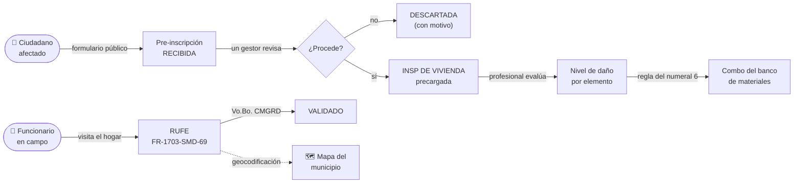
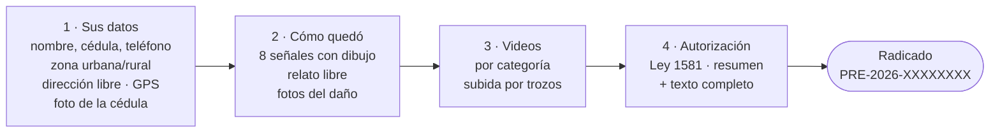
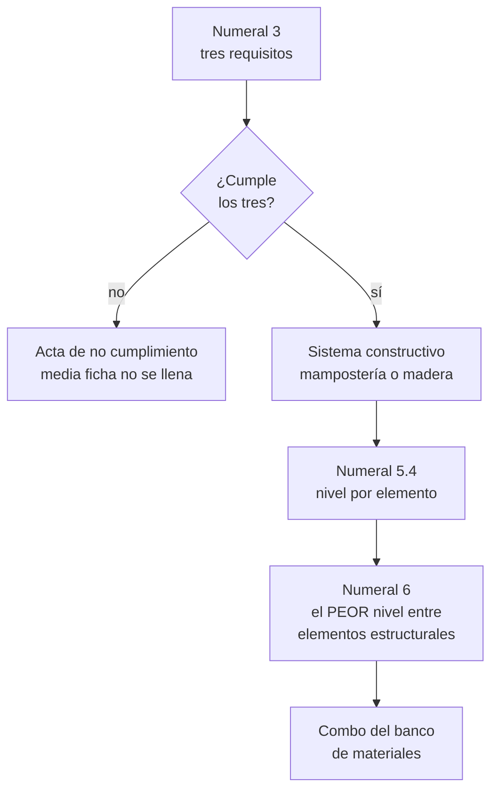
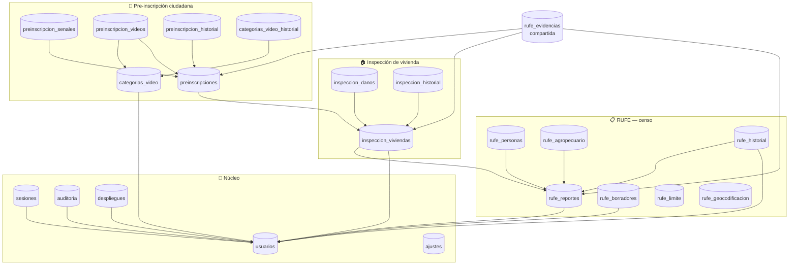
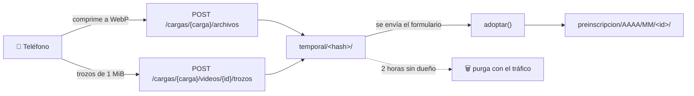

# Sistema de Gestión del Riesgo — Jamundí

Plataforma de gestión del riesgo de desastres de la **Alcaldía Municipal de
Jamundí**. Digitaliza el ciclo completo de atención a una familia afectada por
una emergencia: desde que el ciudadano levanta la mano hasta que un profesional
con tarjeta evalúa su vivienda y el banco de materiales decide qué entregar.

| | |
|---|---|
| Aplicación | <https://grj.oticjamundi.com> |
| API | <https://grj.oticjamundi.com/api> |
| Formulario ciudadano | <https://grj.oticjamundi.com/preinscripcion> |

Todo el sistema vive en **una sola carpeta del hosting**
(`/home1/gilibert/grj.oticjamundi.com`) y bajo **un solo subdominio**. La API se
sirve como subcarpeta `/api` del mismo dominio, no en un subdominio aparte: así
no hay peticiones entre orígenes distintos y el CORS deja de existir como
problema.

---

## Qué hace el sistema

Tres formatos oficiales, tres momentos distintos de la misma emergencia:

| Formato | Quién lo llena | Cuándo |
|---|---|---|
| **Pre-inscripción** | El ciudadano, solo, desde su celular | Apenas ocurre el daño |
| **RUFE FR-1703-SMD-69** | Un funcionario, en la visita | Censo de la emergencia |
| **INSP DE VIVIENDA** | Un profesional con tarjeta | Evaluación técnica |

Y una regla que ordena todo lo demás: **una pre-inscripción no es una
inspección.** Es una solicitud de turno. La evaluación del daño, el combo de
materiales y la aprobación siguen siendo del profesional, porque de esa
clasificación depende cuántos bultos de cemento recibe una familia.



**Nada es oficial hasta que alguien lo firma.** El RUFE entra como `RECIBIDO` y
necesita el Vo.Bo. de un gestor; la inspección entra como `RECIBIDA` y necesita
aprobación. El sistema convierte un sello de papel en un acto con autor, fecha y
nota.

---

## Stack tecnológico

| Capa | Tecnología | Versión |
|---|---|---|
| Frontend | SvelteKit + Svelte (runas) | 2.63 / 5.56 |
| Lenguaje | TypeScript | 6.0 |
| Compilador | Vite | 8.0 |
| Adaptador | `@sveltejs/adapter-static` (SPA, `fallback: 200.html`) | 3.0 |
| Mapas | Leaflet + leaflet.heat | 1.9 |
| Imágenes | `browser-image-compression` (a WebP en el teléfono) | 2.0 |
| PDF | `pdf-lib` (rellena el formato oficial en el navegador) | 1.17 |
| Iconos | `@lucide/svelte` | 1.31 |
| Pruebas | Vitest (`environment: node`) + `fake-indexeddb` | — |
| Backend | PHP **sin Composer y sin framework** | 8.3 (prod) · 8.5 probado |
| Base de datos | MySQL (MariaDB en local) | 5.7 (prod) |
| Servidor | Apache en cPanel compartido, **sin SSH** | — |

Las versiones del servidor las oculta el hosting en las cabeceras. **El valor en
vivo está en `/acerca` → «Sistema actual»**, que las lee de la propia conexión;
las de esta tabla son las que reportaba el panel de cPanel.

Tamaño actual: **41 archivos PHP** (≈11.900 líneas), **60 componentes Svelte**,
**66 módulos TypeScript**, **22 tablas**, **64 rutas de API**.

### Por qué este stack

**El backend no usa Composer ni un framework.** El hosting es cPanel compartido
sin acceso por consola, así que `composer install` no se puede ejecutar en el
servidor, y subir el `vendor/` de un framework serían decenas de megabytes por la
API de cPanel en cada despliegue. Un autoloader PSR-4 de diez líneas cubre la
misma necesidad.

**La autenticación usa un token opaco, no JWT.** Un JWT no se puede revocar sin
mantener igualmente una lista en base de datos. Aquí el token es un valor
aleatorio de 256 bits cuyo SHA-256 se guarda en `sesiones`: desactivar a una
persona o cambiarle el rol cierra sus sesiones en el acto, que es lo que exige un
sistema con datos de familias damnificadas.

**El frontend es una SPA sin pre-renderizado.** Lo que ve cada persona depende de
su sesión, que solo existe en el navegador; generar HTML en el build produciría
la pantalla de un usuario que no existe.

**Todo está pensado para una vereda sin señal.** Autoguardado local, cola de
envío con reintento, compresión de imagen antes de subir, subida de video por
trozos y un Service Worker que guarda el armazón de la aplicación. La foto
original nunca sale del teléfono: lo que viaja es siempre la versión optimizada.

---

## Arquitectura

```
Gestion_riesgo/
├── backend/     API REST en PHP 8 + MySQL    → se despliega en /api
└── frontend/    SvelteKit 2 (build estático) → se despliega en la raíz
```

En el servidor ambos conviven en la misma carpeta:

```
grj.oticjamundi.com/
├── .htaccess          SPA + excluye /api del reenvío a index.html
├── index.html  200.html  robots.txt  _app/
├── icono-*.png  apple-touch-icon.png  manifest.webmanifest
└── api/
    ├── .htaccess      front controller; niega config.php y archivos de datos
    ├── index.php  config.php
    ├── src/       + .htaccess  (Require all denied)
    └── database/  + .htaccess  (Require all denied)

sgr_almacen/                  fotos y videos — hermana del sitio, nunca dentro
├── temporal/<hash-carga>/    cargas sin dueño; caducan en 2 horas
├── rufe/AAAA/MM/<id>/
├── inspeccion/AAAA/MM/<id>/
└── preinscripcion/AAAA/MM/<id>/
```

El hosting solo ofrece una carpeta por sitio, así que el código PHP no puede
colocarse por encima del document root como sería deseable. Se compensa negando
el acceso web a `src/`, `database/` y `config.php` desde `.htaccess`; está
verificado que los tres responden 403.

Las evidencias sí quedan **fuera del docroot**, y esa es la diferencia que
importa: si Apache no puede alcanzarlas, da igual que alguien lograra subir un
archivo ejecutable, porque no existe URL que lo dispare. Un `.htaccess` protege
mientras nadie cambie la configuración del servidor; estar fuera del árbol web
protege siempre.

---

## Módulos

| Módulo | Ruta | Quién entra |
|---|---|---|
| Dashboard — tablero RUFE en vivo | `/dashboard` | Admin, Gestor, Visualización |
| **Pre-inscripción ciudadana** | `/preinscripcion` | **Público, sin sesión** |
| Registro → RUFE FR-1703-SMD-69 | `/riesgo/reportar` | Admin, Gestor |
| Registro → INSP DE VIVIENDA | `/riesgo/inspeccionar` | Admin, Gestor, Inspector |
| Registro → Pendientes (cola sin señal) | `/riesgo/pendientes` | Admin, Gestor, Inspector |
| Reportes → RUFE FR-1703-SMD-69 | `/riesgo/reportes` | Admin, Gestor, Visualización |
| Reportes → Solicitudes ciudadanas | `/riesgo/preinscripciones` | Admin, Gestor, Visualización |
| Reportes → INSP DE VIVIENDA | `/riesgo/inspecciones` | Todos los roles |
| Mapas | `/riesgo/mapas` | Admin, Gestor, Visualización |
| Administración → Usuarios | `/admin/usuarios` | Solo Administrador |
| Administración → Ubicaciones del mapa | `/admin/mapas` | Solo Administrador |
| Administración → Videos que se piden | `/admin/categorias-video` | Solo Administrador |
| Acerca de | `/acerca` | Todos los roles |

**`/preinscripcion` y `/login` son las dos únicas rutas públicas.**
`RUTAS_PUBLICAS` en `frontend/src/lib/navigation.ts` existe para que ampliarlas
sea una decisión visible y no un `if` escondido; una prueba fija que la lista sea
exactamente esas dos.

### Pre-inscripción ciudadana

La abre una persona que perdió parte de su casa, desde su celular, sola y
probablemente alterada. No tiene cuenta ni va a tenerla. Cuatro pasos:



- **La zona se pregunta, no se deduce.** Antes se inferría de si venía
  corregimiento, y era falso: quien vive en el campo y no sabe a qué
  corregimiento pertenece su vereda entraba como urbano y la visita salía al
  pueblo.
- **La dirección es texto libre.** Media zona rural de Jamundí no tiene
  nomenclatura; «la casa azul pasando el puente» es una dirección válida.
- **Ocho señales de daño con su dibujo**, para marcar varias. Son una
  *traducción* del numeral 5.4 del formato de inspección, no una copia: el
  ciudadano dice **qué ve**, y el nivel del Anexo 1 lo pone el profesional. Cada
  señal declara internamente a qué elemento del formato apunta, y una prueba
  comprueba que ninguna apunte a un elemento inexistente.
- **Los dibujos son SVG dentro del archivo**, no fotografías: ocho fotos serían
  un mega que descargar justo en la vereda sin señal. Y una foto de una casa
  agrietada es la casa de alguien.
- **El paso de video se salta solo** si nadie ha definido categorías.
- Nada de datos sensibles: género, etnia y composición del hogar los levanta el
  funcionario en la visita, explicando el aviso de viva voz.

Defensas de la ruta pública: límite de tasa por IP, trampa antirrobot (`sitio_web`),
idempotencia por `envio_id`, huella anti-duplicado (dirección + documento) y
autorización obligatoria con la versión del aviso guardada. **No existe ningún
`GET` público que devuelva pre-inscripciones**: consultar por radicado sería un
buscador de damnificados.

### Dashboard

El tablero del RUFE, con su identidad visual intacta. Lee los datos **en vivo
desde el navegador** del CSV público de la hoja de cálculo del censo
(`src/lib/rufe/source.ts`), los cruza con la base de datos del RUFE y cae en un
respaldo estático (`src/lib/data/rufe-fallback.json`) si la hoja deja de estar
compartida. Incluye vistas de instituciones educativas y equipamientos, cada una
con su propio respaldo.

Es el único módulo que **no** se alimenta de la API de este sistema: nació antes
y sigue leyendo su fuente original.

### RUFE FR-1703-SMD-69

Digitaliza el **Registro Unifamiliar de Emergencias** de la UNGRD. Lo diligencia
un funcionario durante la visita al hogar. Ocho pasos cortos, autoguardado en
`localStorage` (800 ms de retardo) e IndexedDB para las fotos, cola de envío que
sale sola al recuperar cobertura, campos condicionales escritos una sola vez y
espejados en el validador de PHP, dos clases de foto con cupo propio, GPS
opcional y encadenado de fichas para la casa siguiente.

### INSP DE VIVIENDA

Formato de inspección técnica para el **banco de materiales**. Diez pasos, con
una bifurcación de verdad: el numeral 4 decide si se hace la inspección o si se
levanta un acta y se termina.



- El numeral 4 se **deriva** de los tres requisitos en vez de preguntarse aparte.
  El papel permite marcar «cumple» habiendo contestado que la persona no es
  propietaria, y eso produce fichas que se contradicen a sí mismas.
- Los niveles que admite cada elemento **se derivan del Anexo 1**, no se escriben
  aparte: las casillas «N/A» de la tabla son exactamente las combinaciones que el
  anexo no describe. Coinciden una por una.
- Bajo cada combo hay un **acordeón** que muestra la tabla completa de dónde sale
  esa decisión: la regla, la escala, el nivel de cada elemento y el mapa
  nivel→combo. Quien revisa puede auditar el resultado sin conocer el código.
- Fotos del numeral 11 con pie de foto, GPS y detección de duplicados.

### Bandeja de solicitudes ciudadanas

Cada renglón muestra **los dibujos** de las señales que marcó el ciudadano —las
mismas figuras que él vio—, qué adjuntó (cédula, fotos, videos), la zona y si
tomó ubicación. La ficha reproduce los videos en la propia página. El botón que
importa es **«Convertir en inspección»**, que abre el formato con propietario,
dirección y coordenadas ya cargados.

Las **coordenadas no viajan al listado**, solo el hecho de que existan: en una
pantalla que no las usa serían el punto exacto de la casa de una familia
repetido veinticinco veces por página.

### Mapas

Ubica **las fichas del censo** sobre el municipio —las inspecciones y las
solicitudes ciudadanas guardan su punto GPS pero todavía no se dibujan aquí—. La
geocodificación se cachea en `rufe_geocodificacion` y hace tres intentos por
ficha; una fuente caída no tumba el mapa.

### Administración

- **Usuarios** — alta, edición, activación, restablecimiento y borrado. Un
  administrador no puede cambiar su propio rol, desactivarse ni eliminarse, y el
  sistema nunca se queda sin al menos un administrador activo.
- **Ubicaciones del mapa** — rehacer y completar la geocodificación.
- **Videos que se piden** — catálogo de categorías de video: nombre, instrucción,
  orden, obligatoriedad y duración. Una categoría con videos asociados **no se
  borra, se desactiva**. Todo cambio queda en `categorias_video_historial`.

---

## Roles

| Rol | Alcance |
|---|---|
| **Administrador** | Control total, incluida la gestión de usuarios y el borrado. |
| **Gestor** | Lectura y escritura del censo, decide sobre las fichas. |
| **Insp. de vivienda** | Solo el formato de inspección. **No ve fichas del censo.** |
| **Visualización** | Solo consulta de indicadores y tableros. |

El rol de inspector suele ser un contratista externo: las fichas del censo llevan
nombres, cédulas y direcciones de hogares damnificados, y él no las necesita. Una
prueba enumera **a mano** las rutas exactas a las que llega — derivarla del
código haría que la prueba dijera «sí» a cualquier cosa que el código dijera.

El control de acceso se aplica en tres capas, todas derivadas del mismo registro:

1. **Menú** — `frontend/src/lib/navigation.ts` filtra lo que se dibuja.
2. **Rutas del navegador** — el mismo archivo alimenta la guardia del layout.
3. **API** — `backend/src/Core/Router.php` exige el rol en cada ruta. **Esta es la
   única capa que cuenta como seguridad:** ocultar un botón no protege nada.

---

## Base de datos

22 tablas en cuatro grupos. Las flechas son claves foráneas.



### Núcleo — `schema.sql`

| Tabla | Para qué |
|---|---|
| `usuarios` | Rol como ENUM (`ADMINISTRADOR`, `GESTOR`, `VISUALIZACION`, `INSPECTOR`) más los datos del profesional que inspecciona. Son roles fijos, no un catálogo administrable: una tabla aparte solo añadiría un JOIN por petición. |
| `sesiones` | Token **hasheado**, expiración, IP y agente. |
| `auditoria` | Quién hizo qué y sobre qué registro. |
| `ajustes` | Clave/valor; hoy guarda la caché de GitHub. |
| `despliegues` | Historial de actualizaciones aplicadas desde la propia aplicación. |

### RUFE — `rufe.sql`

| Tabla | Para qué |
|---|---|
| `rufe_reportes` | Cabecera; un registro por unidad familiar afectada. Estados: `RECIBIDO → EN_VALIDACION → VALIDADO / RECHAZADO / ARCHIVADO`. |
| `rufe_personas` | De 1 a 10 personas, con el `orden` del renglón del formato. |
| `rufe_agropecuario` | De 0 a 4 renglones. |
| `rufe_historial` | Cada cambio de estado, con el correo del funcionario **desnormalizado** para que sobreviva a su borrado. |
| `rufe_borradores` | Solo de funcionarios autenticados. |
| `rufe_limite` | Contadores del control de tasa, con la IP derivada a SHA-256. |
| `rufe_geocodificacion` | Caché de direcciones ya ubicadas en el mapa. |
| `rufe_evidencias` | **Compartida por los tres módulos.** Nace con dueño nulo (carga temporal) y se adopta al enviar. `tipo`: `DOCUMENTO`, `DANO`, `INSPECCION`, `PRE_CEDULA`, `PRE_DANO`. |

### Inspección — `inspeccion_01_viviendas.sql`, `inspeccion_02_ubicacion.sql`

| Tabla | Para qué |
|---|---|
| `inspeccion_viviendas` | 58 columnas: el formato completo. Estados: `RECIBIDA → EN_VALIDACION → APROBADA / RECHAZADA / ARCHIVADA`. |
| `inspeccion_danos` | Un renglón por elemento evaluado, con su nivel. |
| `inspeccion_historial` | Cada cambio de estado con su autor y su nota. |

### Pre-inscripción — `preinscripcion_01.sql`, `_02_video.sql`, `_03_pasos.sql`

| Tabla | Para qué |
|---|---|
| `preinscripciones` | La solicitud. Estados: `RECIBIDA → EN_REVISION → CONVERTIDA / DESCARTADA`. `zona`: `URBANA`/`RURAL`. Guarda `huella`, `envio_id`, la versión del aviso aceptado y el hash de la IP con sal. |
| `preinscripcion_senales` | Una fila por señal marcada, **con la etiqueta que se le mostró**: si mañana se reescribe un criterio, el expediente sigue diciendo qué marcó la persona. |
| `preinscripcion_videos` | Un video por categoría, con su troceo y su estado de subida. |
| `preinscripcion_historial` | Cambios de estado y sucesos: archivos añadidos en un reenvío, video perdido por mala conexión. |
| `categorias_video` | Catálogo administrable de qué videos se piden. |
| `categorias_video_historial` | Trazabilidad de altas, ediciones y bajas. |

Los códigos de documento, parentesco, género y etnia **no** son tablas de
catálogo: son números impresos en un formato con versión controlada por la UNGRD.
Viven en `backend/src/Rufe/Catalogos.php`, que es su fuente única —el frontend los
pide por API en vez de duplicarlos en TypeScript— y se guarda el código, no la
etiqueta, para que un cambio de redacción no invalide los registros históricos.

### Migración

No hay herramienta de migraciones: todo el SQL es idempotente
(`CREATE TABLE IF NOT EXISTS`, `ALTER` guardado por `information_schema`) y
`backend/src/Core/Migrador.php` lo aplica en este orden:

```
 1. schema.sql                      7. inspeccion_02_ubicacion.sql
 2. rufe.sql                        8. sistema_02_rol_inspector.sql
 3. rufe_02_evidencias_y_envio.sql  9. preinscripcion_01.sql
 4. sistema_01_despliegues.sql     10. evidencias_03_tipos.sql
 5. mapa_01_geocodificacion.sql    11. preinscripcion_02_video.sql
 6. inspeccion_01_viviendas.sql    12. preinscripcion_03_pasos.sql
```

El orden no es alfabético a propósito: `rufe.sql` declara claves foráneas contra
`usuarios`, así que `schema.sql` tiene que ir antes.

Una prueba del arnés **impide que una migración destruya datos**: rechaza
`DROP`, `TRUNCATE` y los `MODIFY COLUMN` que estrechen un ENUM. Solo se admite
ensanchar, y únicamente los ENUM declarados como ampliables.

---

## API

Base: `https://grj.oticjamundi.com/api`. Autenticación con
`Authorization: Bearer <token>`. **64 rutas, 9 públicas.**

### Públicas — sin sesión

| Método | Ruta |
|---|---|
| `GET` | `/health` |
| `POST` | `/auth/login` |
| `GET` | `/preinscripcion/catalogos` |
| `POST` | `/preinscripcion/cargas` |
| `POST` `DELETE` | `/preinscripcion/cargas/{carga}/archivos[/{id}]` |
| `POST` | `/preinscripcion/cargas/{carga}/videos` |
| `POST` | `/preinscripcion/cargas/{carga}/videos/{id}/trozos` |
| `POST` | `/preinscripcion` |

### Sesión — todos los roles

`GET /auth/me` · `POST /auth/logout` · `POST /auth/password` ·
`GET /acerca/sistema` · `GET /acerca/actualizaciones` ·
`GET /inspeccion/fichas[/{id}][/fotos/{foto}]`

### RUFE

| Método | Ruta | Rol |
|---|---|---|
| `GET` | `/rufe/reportes[/{id}][/evidencias/{id}]` | Admin, Gestor, Visualización |
| `GET` | `/rufe/catalogos` | Admin, Gestor |
| `POST` `PUT` | `/rufe/reportes[/{id}][/estado]` | Admin, Gestor |
| `GET` `POST` `DELETE` | `/rufe/borradores[/{clave}]` | Admin, Gestor |
| `POST` `GET` `PUT` `DELETE` | `/rufe/cargas[/{carga}/archivos[/{id}]]` | Admin, Gestor, Inspector |
| `POST` | `/rufe/reportes/{id}/anonimizar` | Solo Administrador |

### Inspección, mapas, pre-inscripción y administración

| Método | Ruta | Rol |
|---|---|---|
| `GET` `POST` | `/inspeccion/catalogos` · `/duplicados` · `/fichas` | Admin, Gestor, Inspector |
| `PUT` | `/inspeccion/fichas/{id}/estado` | Admin, Gestor |
| `GET` `POST` | `/mapa/fichas` · `/mapa/ubicaciones` | Admin, Gestor, Visualización |
| `PUT` | `/mapa/ubicaciones/{clave}` | Admin, Gestor |
| `GET` `POST` | `/mapa/estado` · `/geocodificar` · `/reubicar` | Solo Administrador |
| `GET` | `/preinscripcion/fichas[/{id}][/fotos/…][/videos/…]` | Admin, Gestor, Visualización |
| `PUT` | `/preinscripcion/fichas/{id}/estado` | Admin, Gestor |
| `DELETE` | `/preinscripcion/fichas/{id}` | **Solo Administrador** |
| `GET` `POST` `PUT` `DELETE` | `/admin/categorias-video[/…]` | Solo Administrador |
| `GET` `POST` | `/sistema/actualizaciones` · `/sistema/actualizar` | Solo Administrador |
| `GET` `POST` `PUT` `DELETE` | `/usuarios[/{id}][/password]` | Solo Administrador |

---

## Archivos: fotos y videos



| Límite | Valor |
|---|---|
| Foto, tamaño máximo | 1 MiB (objetivo tras comprimir: 900 KB) |
| Carga completa | 12 MiB |
| Fotos de pre-inscripción | 4 del daño + 1 de la cédula |
| Video: trozo / máximo / por carga | 1 MiB · 8 MiB · 8 videos |
| Caducidad de una carga sin dueño | 2 horas |

- **La foto original nunca sube al servidor**: se comprime en el teléfono.
- **El token de la carga no se guarda en ninguna tabla**: solo su SHA-256
  acompaña a cada archivo. Adivinarlo exige acertar 256 bits.
- **Al adoptar, los archivos se mueven** a la carpeta definitiva de su ficha.
  Dejarlos en `temporal/` era una trampa: el día que alguien limpiara una carpeta
  llamada «temporal» se llevaría por delante los videos de expedientes reales.
- **No hay cron en el hosting**, así que la purga viaja montada en el tráfico que
  ya ocurre (abrir una carga, abrir la bandeja).

---

## Desarrollo local

```bash
# Backend
cd backend
cp config.example.php config.php     # completar credenciales de MySQL
php -S localhost:8000 -t public

# Frontend
cd frontend
npm install
npm run dev                          # http://localhost:5173
```

El cliente de la API resuelve la URL base por dominio
(`frontend/src/lib/api/client.ts`): en `localhost` apunta a `localhost:8000` y en
cualquier otro sitio a producción. Así el mismo build sirve en los dos lados sin
recompilar.

### Comprobaciones

```bash
cd frontend && npm run check && npm test    # 0 errores de tipos · 548 pruebas
npm run build

find backend -name '*.php' -exec php -l {} \;
php backend/tests/run.php                   # 260 pruebas, sin base de datos
```

`backend/tests/run.php` es un arnés en PHP plano: no hay Composer en el hosting
ni forma de instalarlo, así que tampoco hay PHPUnit. Cubre código puro
—validación, catálogos, radicado, troceo del SQL, roles por ruta— y por eso corre
en cualquier máquina sin montar nada.

**Lo que las pruebas sin base de datos no pueden ver.** Este proyecto ha
encontrado varios fallos reales solo al probar contra MySQL de verdad: una
columna que faltaba en un `INSERT`, un ENUM que no admitía un valor que el código
ya usaba, un aviso de PHP colándose dentro del cuerpo de una respuesta. Antes de
dar por buena una función que toca la base, **pruébela con una petición real
contra el servidor local.**

Para preparar esa base local, aplique el esquema con el migrador por web —que es
el mismo camino que se usa en el servidor, porque aquí no hay consola:

```bash
curl -X POST 'http://localhost:8000/migrar.php?clave=LA_INSTALL_KEY'
```

También hay un guion de comprobaciones HTTP por rol
(`backend/tests/http.sh`) que inicia sesión con cada rol y verifica que llega
hasta donde debe y no más. **No lo ejecute contra producción**: crea reportes de
verdad.

---

## Despliegue

No hay SSH en el hosting. Todo se hace por la API de cPanel sobre HTTPS con el
header `Authorization: cpanel <usuario>:<token>`.

```bash
cd frontend && npm run build          # genera build/ con index.html y .htaccess
```

Luego, por cada destino:

1. Empaquetar en ZIP el contenido a subir.
2. `POST /execute/Fileman/upload_files` con `dir`, **`overwrite=1`** y el archivo.
   Sin `overwrite=1` cPanel rechaza en silencio los archivos que ya existen —y
   responde `status: 1`, así que **parece un éxito y no lo es**.
3. Extraer: `/json-api/cpanel?cpanel_jsonapi_module=Fileman&cpanel_jsonapi_func=fileop&op=extract`
   (la UAPI no expone extracción).
4. Borrar el ZIP con el mismo `fileop` pero `op=unlink`.

El paquete de la API va **aplanado**: `public/index.php` sube a la raíz de `api/`,
junto a `src/`, `database/` y `config.php`. El front controller detecta esa
disposición y resuelve su raíz en consecuencia.

| Qué | Dónde |
|---|---|
| Frontend | `/home1/gilibert/grj.oticjamundi.com` |
| API | `/home1/gilibert/grj.oticjamundi.com/api` |
| Configuración | `…/api/config.php` — negada por `.htaccess` |
| Fotos y videos | `/home1/gilibert/sgr_almacen` — **fuera** del docroot |

### Verificación después de desplegar

```bash
curl -s https://grj.oticjamundi.com/api/health
curl -s -o /dev/null -w '%{http_code}\n' https://grj.oticjamundi.com/api/rufe/reportes   # 401
curl -s -o /dev/null -w '%{http_code}\n' https://grj.oticjamundi.com/api/instalar.php    # 404
```

Y para el frontend, comprobar que un texto nuevo llega de verdad: localizar el
fragmento en `build/_app/immutable/` y pedirle ese mismo archivo a producción.
Buscar «a ojo» en los primeros fragmentos no sirve — cada página va en el suyo.

### Iconos de la aplicación instalable

```bash
node frontend/scripts/generar-iconos.mjs
```

Deriva los cuatro iconos del escudo oficial. Usa `qlmanage` y `sips` de macOS:
Chrome sin ventana se cuelga en este equipo, y bajar `sharp` o `playwright` para
cuatro imágenes que cambian una vez al año no compensa.

---

## Notas de seguridad

- Contraseñas con `password_hash`/bcrypt; mínimo 10 caracteres.
- El login responde igual ante un correo inexistente y una contraseña
  incorrecta, y verifica contra un hash falso cuando el usuario no existe, para
  que el tiempo de respuesta no delate qué correos están registrados.
- Cambiar la contraseña cierra las demás sesiones de esa persona.
- CORS con lista blanca; nunca se refleja un origen arbitrario.
- Los errores 500 no exponen el detalle en producción.
- La bitácora de auditoría nunca interrumpe la operación que la origina.

### Archivos

Nada de lo que envía el cliente construye una ruta: el nombre en disco se genera
con `random_bytes` y la extensión sale de una lista blanca. El tipo se determina
**leyendo el contenido** con `finfo`, nunca con el encabezado que declara el
navegador. El `Content-Type` de salida se deriva de la extensión —que la pone el
servidor— y nunca del `mime` que mandó quien subió el archivo: devolver como
Content-Type una cadena elegida por el que sube es la forma clásica de convertir
una descarga en un XSS.

El hosting compartido no ofrece antivirus: es una limitación asumida, mitigada
con lista blanca, límites de tamaño y cantidad, renombrado y almacenamiento
inalcanzable por web.

### Datos personales

- La IP se guarda **derivada a SHA-256 con sal**, no en claro.
- Identidad de género y pertenencia étnica son categorías especiales del art. 5
  de la Ley 1581 de 2012: se piden con una autorización **separada** y se guarda
  con cada ficha la versión del aviso aceptado y el instante en que se aceptó.
- El radicado son 8 caracteres aleatorios en Crockford Base32 (sin I, L, O ni U,
  para poder dictarlo por teléfono), **no el `id`**. No hay forma de enumerar.
- El borrador nunca sale del dispositivo mientras la ficha no se envíe, y las
  casillas de autorización no se guardan en él.
- **Borrar una solicitud** es la única operación que destruye datos de un
  ciudadano: solo Administrador, exige motivo, queda en auditoría con el radicado
  y el nombre, borra también los archivos del disco, y **se niega si la solicitud
  ya se convirtió en inspección** —sería lo único que explica esa visita—.

### Retención

| Qué | Cuánto |
|---|---|
| Reportes | 5 años desde `VALIDADO`; luego anonimización |
| Evidencias | 2 años desde `VALIDADO` |
| Videos ciudadanos | hasta que se decide la solicitud |
| Cargas sin adoptar | 2 horas |
| Borradores de funcionario | 30 días |

No hay cron en el hosting, así que la limpieza de lo efímero viaja montada en el
propio tráfico. **La retención a años es una tarea manual: no está automatizada.**

---

## Estado y pendientes conocidos

- El **catálogo de categorías de video** lo define quien tenga el criterio
  estructural para decidir qué debe grabarse. Mientras esté vacío, el paso de
  video no aparece.
- Falta la **prueba de campo real en zona rural**, con un Android y un iPhone:
  es lo único que decide si la subida de video funciona de verdad.
- La retención a años no está automatizada.
- Ninguna ficha de inspección guarda de qué pre-inscripción nació; el enlace es
  de una sola dirección.
